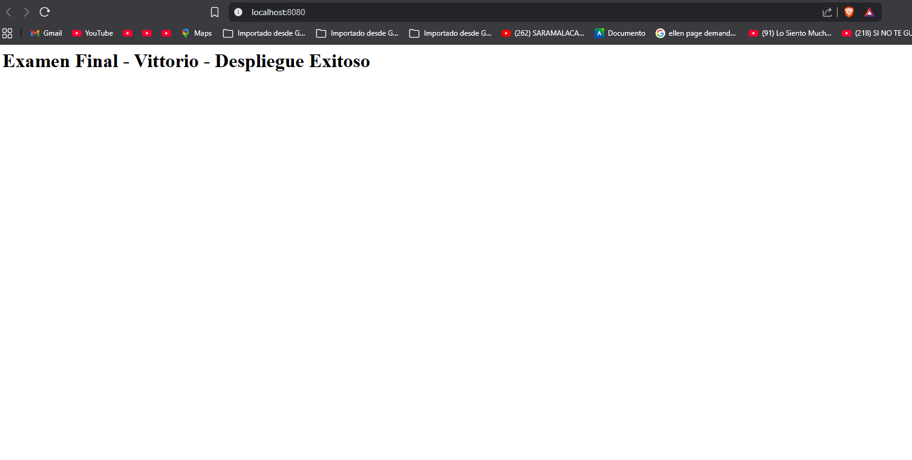
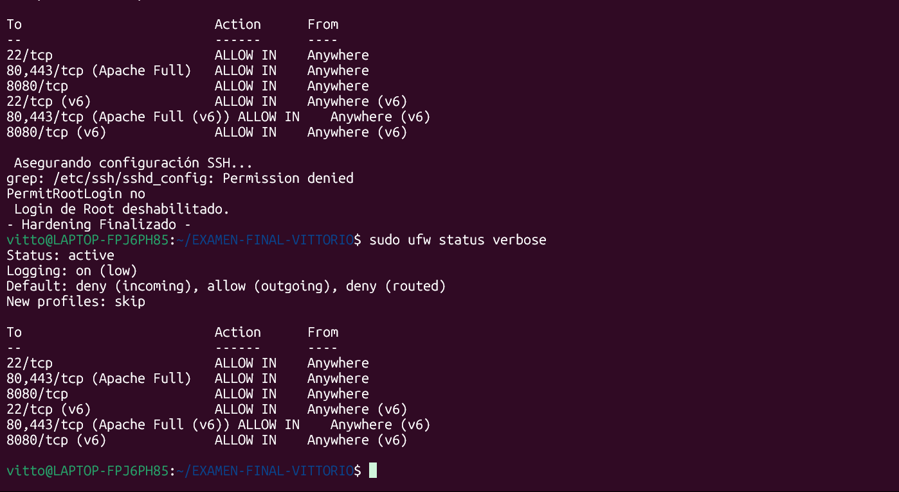
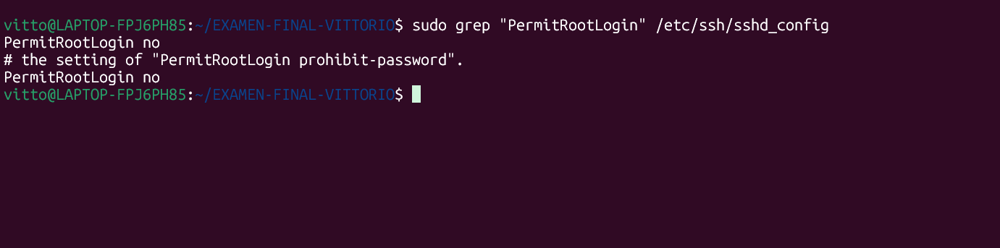

cat << 'EOF' > README.md
# Examen Final: Automatización de Infraestructura Web

Hola, este repositorio contiene mi entrega para el examen final. El objetivo fue crear un entorno web automatizado con Nginx, asegurarlo (hardening) y preparar scripts de mantenimiento, todo organizado según lo pedido en la rúbrica.

##  Organización del Repo

Ordend de los archivos

* **`deploy/`**: Aquí está el `docker-compose` y el script para levantar el sitio.
* **`security/`**: Scripts para configurar el Firewall y SSH (Hardening).
* **`maintenance/`**: Script para hacer los backups del sitio.
* **`evidence/`**: Las capturas de pantalla que demuestran que todo funciona.

---

##  ¿Cómo desplegar este proyecto?

Si quieres probarlo en una máquina limpia, sigue estos pasos en orden.

**Requisitos:**
 tener instalado Docker, Git y tener permisos de administrador (`sudo`).

### Pasos:

1.  **Clonar el proyecto:**
    ```bash
    git clone <URL_DEL_REPOSITORIO>
    cd NOMBRE-REPO-FINAL
    ```

2.  **Levantar el servidor web:**
    Este script crea el `index.html` y enciende el contenedor.
    ```bash
    chmod +x deploy/setup.sh
    ./deploy/setup.sh
    ```

3.  **Aplicar seguridad (Importante):**
    Configura el UFW y bloquea el acceso root.
    ```bash
    chmod +x security/hardening.sh
    ./security/hardening.sh
    ```

4.  **Probar el Backup:**
    Genera un respaldo de la carpeta web.
    ```bash
    chmod +x maintenance/backup.sh
    ./maintenance/backup.sh
    ```

---

## Justificación de Seguridad 

Para cumplir con los requerimientos de seguridad vistos, implementé estas dos medidas clave:

**1. Deshabilitar el login de Root (SSH):**
Entrar directo como `root` es muy inseguro porque es el usuario que todos los hackers intentan atacar primero (fuerza bruta). Al poner `PermitRootLogin no` en la configuración de SSH, obligamos a que cualquier conexión use un usuario normal primero. Esto mejora la seguridad y también la trazabilidad, porque así sabemos quién entró y quién usó `sudo`.

**2. Filtrado de puertos (UFW):**
 política de  (Default Deny). Esto significa que el Firewall bloquea todo lo que no esté explícitamente permitido. Solo abrí el puerto **22** (para administrar por SSH) y el **8080** (para ver la web). Así reducimos la superficie de ataque y evitamos que se expongan servicios que no deberían estar públicos.

---

## Evidencia de funcionamiento

Aquí están las capturas que validan que cada parte del examen funciona correctamente:

### El sitio web funciona (Puerto 8080)


### El Firewall está activo y configurado


### Configuración SSH modificada

EOF
